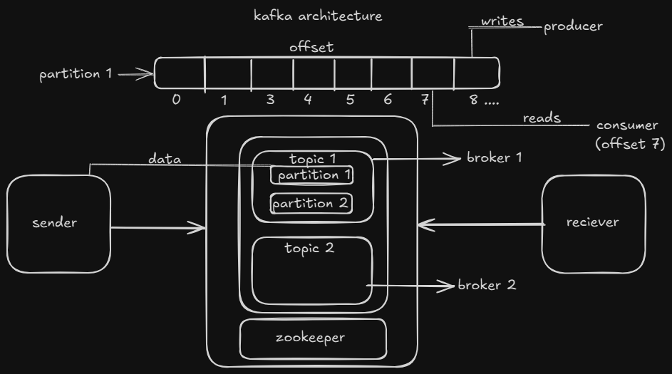

# Cab Book - Kafka Demo (Driver & User)   

This is a **basic implementation of Apache Kafka** using Spring Boot to demonstrate real-time communication between a **cab driver** and a **user**.It is intended for educational purposes, to help understand the core concepts of Kafka in a
microservices-like setup, check out more.

---

## What This Project Demonstrates

- Kafka **topic creation** with Spring Boot.
- Kafka **producer**: Sending cab location updates from the driver.
- Kafka **consumer**: Listening for cab location updates on the user side.
- Basic simulation of **real-time location updates**.

---

## Project Structure

### `cab-book-driver` (Producer)

- Sends random cab location updates to the Kafka topic `cab-location`.
- Uses `KafkaTemplate` to produce messages.

### `cab-book-user` (Consumer)

- Listens for updates on the Kafka topic `cab-location`.
- Logs received location updates.

---

## Architecture Diagram



## How to Run

### Prerequisites

- [Kafka](https://kafka.apache.org/quickstart) running on `localhost:9092`
- Java 17+
- Maven

### Steps

1. **Start Kafka & Zookeeper**

   If using local setup (default ports assumed):
    ```bash
    # Start Zookeeper
    bin/zookeeper-server-start.sh config/zookeeper.properties

    # Start Kafka
    bin/kafka-server-start.sh config/server.properties
    ```

2. **Run `cab-book-user`**
    - This will listen for location updates.
    - `server.port=8081`

3. **Run `cab-book-driver`**
    - This will simulate sending location updates every second for 100 seconds.
    - Endpoint to trigger: `PUT /location` (e.g., via Postman or curl)
    - `server.port=8082`

   Example using `curl`:
   ```bash
   curl -X PUT http://localhost:8082/location

---

## Note

This is **not** a **full-fledged** cab booking system. It's a minimal, educational project for getting started with
Kafka using a simple producer-consumer model.
